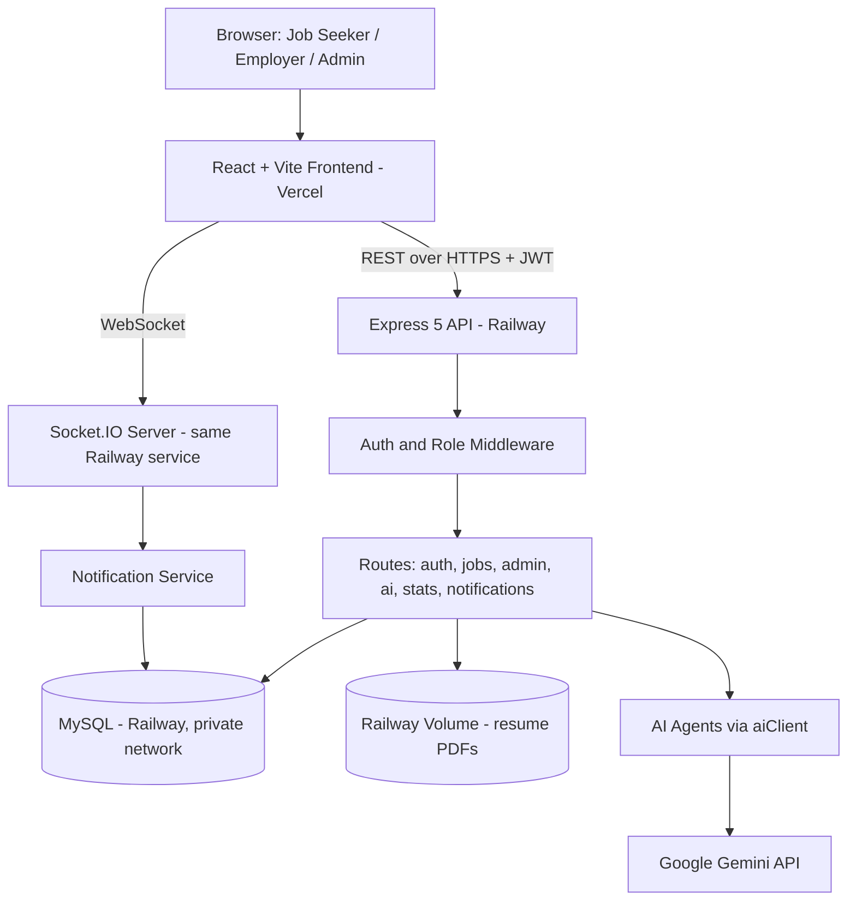
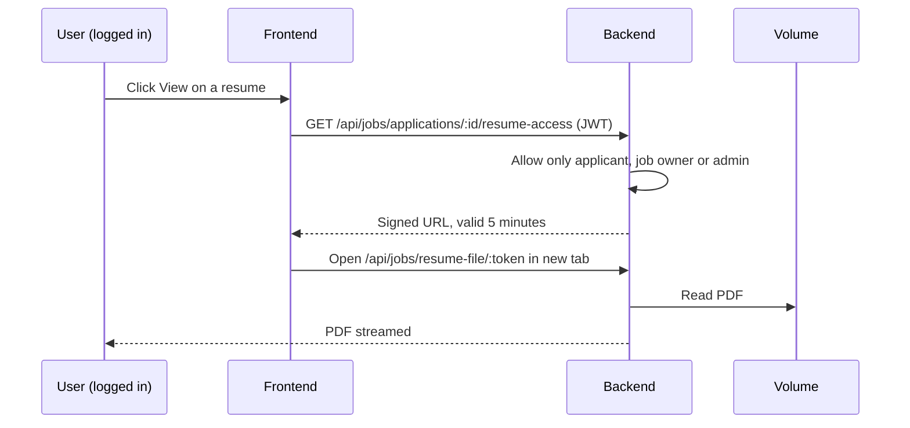

# VPlacement: AI-Powered Job & Internship Placement Portal

A full-stack placement portal for college students, employers and campus admins, with five purpose-built AI agents handling job matching, applicant screening, job-post writing, career chat and platform insights.

**Live app:** [v-placement.vercel.app](https://v-placement.vercel.app)
*(Hosted on free tiers, so it may occasionally be offline or slow to wake up.)*

   
   
   
   
## The problem

Campus placement usually runs on scattered spreadsheets, email threads and shared drives. Students don't know which openings fit them, employers drown in unranked applications, and admins have no single view of what's happening. Resumes end up as public links that anyone can forward.

## What VPlacement does

VPlacement puts all three roles on one platform, with real-time updates and AI assistance where it genuinely saves time, and with student resumes kept private by design.

- **Three roles, one platform:** job seekers, employers and admins each get a dedicated dashboard.
- **Secure resume uploads:** PDF upload (10MB cap) stored on a persistent volume. Resumes are never public: viewing one issues a 5-minute signed link, and only the applicant, the job's employer or an admin can request it.
- **Application tracking:** employers can Accept, Reject or Reset each applicant, and the status updates on the job seeker's side.
- **Real-time notifications:** Socket.IO delivers new applications, status changes and new job posts instantly, with history stored in the database so nothing is missed between sessions.
- **Custom dark UI:** a hand-built "Ultraviolet Solar Matrix" theme (glass panels, violet, magenta and amber accents) across every page.

### The five AI agents (Google Gemini)

| Agent | Who uses it | What it does |
|---|---|---|
| **Matching** | Job seeker | Scores open jobs against a student's skills and interests |
| **Screening** | Employer | Ranks applicants for a job from their cover letters |
| **Job Posting** | Employer | Drafts a title and description from rough notes |
| **Career Assistant** | Everyone | Chat widget for resume tips, interview prep and open-role questions |
| **Insights** | Admin | Summarizes platform activity with one actionable recommendation |

All AI calls go through a single wrapper (`services/aiClient.js`), so the API key, model name and error handling live in one place. AI failures return a clean error to the UI instead of crashing the server.

---

## Architecture



### Resume access flow



### Deployment topology

| Layer | Platform | Notes |
|---|---|---|
| Frontend | Vercel | Repo root, auto-deploys on push |
| Backend | Railway service | Root Directory `jobportal-backend`, listens on `process.env.PORT` |
| Database | Railway MySQL | Reached over the private network, no public access |
| Resume files | Railway Volume | Mounted at `/app/uploads`, survives redeploys |

---

## Tech stack

| Layer | Stack |
|---|---|
| Frontend | React, Vite, Tailwind CSS, React Router, Axios, Socket.IO client |
| Backend | Node.js 18+, Express 5, `mysql2`, JWT (`jsonwebtoken`), `bcryptjs`, Socket.IO, Multer 2 |
| Database | MySQL |
| AI | Google Gemini API (model set by `GEMINI_MODEL`) |
| Hosting | Vercel (frontend), Railway (backend, MySQL, volume) |

---

## Project structure

A monorepo: the frontend lives at the repo root and the backend in its own folder.

```
VPlacement/
├── src/                          # React frontend
│   ├── api/                      # Axios service layer, one file per backend resource
│   ├── components/
│   │   ├── ai/                   # Frontend components for the 5 AI agents
│   │   └── ResumeLink.jsx        # Opens resumes through signed links
│   ├── context/                  # Auth and notification state
│   └── pages/                    # One folder per role (admin / employer / jobs / jobseeker)
├── jobportal-backend/
│   ├── routes/                   # auth, jobs, admin, ai, stats, notifications
│   ├── services/
│   │   ├── agents/               # Backend logic for the 5 AI agents
│   │   ├── aiClient.js           # Single Gemini wrapper
│   │   └── notificationService.js
│   ├── middleware/               # JWT auth and role authorization
│   ├── uploads/                  # Resume PDFs (git-ignored, volume on Railway)
│   ├── db.js                     # MySQL connection pool
│   └── server.js                 # Express + Socket.IO entry point
└── README.md
```

---

## API overview

| Prefix | Purpose | Access |
|---|---|---|
| `/api/auth` | Register and log in | Public |
| `/api/jobs` | Jobs CRUD, applications, status updates, resume upload and access | Role-based |
| `/api/admin` | User and platform management | Admin |
| `/api/ai` | `match`, `screen/:jobId`, `generate-job-description`, `chat`, `insights` | Role-based (`chat` is public) |
| `/api/notifications` | Notification history | Logged in |
| `/api/stats` | Public homepage statistics | Public |

---

## Running locally

### Prerequisites
- Node.js 18+
- A local MySQL server (XAMPP works)
- A free [Gemini API key](https://aistudio.google.com/apikey)

### 1. Clone and install
```bash
git clone https://github.com/adityashete207/VPlacement.git
cd VPlacement
npm install
cd jobportal-backend && npm install && cd ..
```

### 2. Set up the database
Create an empty MySQL database, then load the schema:
```bash
mysql -u <user> -p <database_name> < jobportal-backend/schema.sql
```
This creates the `users`, `jobs`, `applications` and notification tables.

### 3. Configure environment variables

**`jobportal-backend/.env`** (copy from `.env.example`):
```
PORT=5000
FRONTEND_URL=http://localhost:5173
JWT_SECRET=<any long random string>
JWT_EXPIRE=7d
DB_HOST=localhost
DB_PORT=3306
DB_USER=<your mysql user>
DB_PASSWORD=<your mysql password>
DB_NAME=<your database name>
GEMINI_API_KEY=<your key from aistudio.google.com>
GEMINI_MODEL=gemini-3.5-flash-lite
```

**`.env`** at the repo root (frontend):
```
VITE_BACKEND_URL=http://localhost:5000
```

### 4. Run it
```bash
# Terminal 1: backend
cd jobportal-backend
npm start

# Terminal 2: frontend
npm run dev
```
Open `http://localhost:5173`.

### 5. Create an admin account
Register a normal account in the UI, then promote it:
```sql
UPDATE users SET role = 'admin' WHERE email = 'your@email.com';
```

---

## Deployment

The live version runs on **Vercel** (frontend) and **Railway** (backend, MySQL and a volume).

**Railway (backend service)**
1. Add MySQL, then add the repo as a second service in the same project.
2. Set Root Directory to `jobportal-backend`, generate a public domain.
3. Variables: `DB_HOST`, `DB_PORT`, `DB_USER`, `DB_PASSWORD`, `DB_NAME` as references to the MySQL service (`${{MySQL.MYSQLHOST}}` and so on), plus `JWT_SECRET`, `JWT_EXPIRE`, `GEMINI_API_KEY`, `GEMINI_MODEL`, `FRONTEND_URL` (the exact Vercel URL, no trailing slash) and `NODE_ENV=production`.
4. Attach a Volume to the backend service with mount path `/app/uploads`.
5. Load the schema once through a temporary public MySQL connection, then remove public access.

**Vercel (frontend)**
1. Import the repo (Vite is auto-detected, Root Directory `/`).
2. Set `VITE_BACKEND_URL` to the Railway backend URL (with `https://`, no trailing slash, no `/api`).
3. Redeploy after any variable change, since Vite reads variables at build time.

---

## Security notes

- Resumes are **not publicly accessible by URL**. Viewing one needs a valid login and issues a short-lived, signed 5-minute link, checked against the applicant, the job's employer or an admin. Stored filenames are random.
- Passwords are hashed with `bcryptjs`, and routes are protected with JWT and role checks.
- CORS only allows the configured `FRONTEND_URL`, for both the REST API and Socket.IO.
- Secrets (`JWT_SECRET`, `GEMINI_API_KEY`, database credentials) live only in each environment's own `.env` or hosting dashboard and are never committed (see `.gitignore`).
- The MySQL database has no public access in production.

## Known limitations

- Resumes live on a single Railway volume. For larger scale, cloud storage (S3, R2 or Cloudinary) would be the next step.
- The backend has a few seconds of downtime on each deploy because of the attached volume.
- AI screening ranks from cover letters only; it does not read resume contents.

---

## Acknowledgments

Built as a college project, progressively upgraded from a standard job-portal CRUD app into an AI-native platform with real resume handling, live status tracking and a custom visual identity.